> 배포서버 : http://i4d102.p.ssafy.io/
>
> (Galaxy S5에 최적화)


## SSAC (SSAFY Sports as Clalender)

> 캘린더에 관람하고자 하는 모든 종목의 스포츠 경기를 ‘큐레이팅’ 하고, 그 일정을 팔로워들과 공유하는 SNS


## 프로젝트 기획배경

1. 스포츠 경기를 관람할 때 마다 함께 관람할 사람을 찾는 것이 번거로워서, 
   내가 보고자 하는 경기와 친구가 보고자 하는 경기를 공유함으로써 편하게 관람 
   메이트를 찾기 위해서
2. 원래는 종목 별로 경기 일정을 따로 확인해야 하는데, 종목 상관없이 내가 
   관심있는 팀의 일정을 한꺼번에 확인하기 위해서


## 프로젝트 상세 소개

인증이 된 사용자는 캘린더에 사용자가 관심 등록해 놓은 스포츠 팀들의 경기 일정을 종목(축구, 야구, 롤챔스) 상관없이 한꺼번에 확인할 수 있으며, 카테고리 별로도 확인할 수 있습니다.

 팔로우한 사용자들과 함께 서로의 경기 관람 스케줄을 공유하며, 실시간으로 채팅을 하며 의견을 공유할 수 있습니다. 

그리고 관심 등록한 팀 외에 다른 팀들을 추천 받을 수 있습니다. 순위 탭을 누르면 팀 순위나 개인 순위를 확인할 수 있습니다. 승부 예측하여 승부 결과를 맞힌 경우, 포인트를 획득하게 됩니다. 


## 팀원 정보 및 업무 분담 내역

#### 팀장 : 이지원

* Back-end
  * DB
    * MySQL을 이용해 DB를 설계하고 Mybatis를 사용해 백엔드서버와 연동
  * 백엔드서버
    * Spring Boot를 이용해 RESTful하게 데이터를 주고 받을 수 있는 서버 구축
    * Swagger를 사용해 프론트엔드에서 쉽게 데이터 통신 결과를 확인할 수 있게 설정
  * 채팅서버
    * Spring Boot와 WebSocket, Stomp를 이용해 실시간 채팅이 가능한 서버 구축
  * 배포
    * AWS EC2 서버에서 Nginx를 이용해서 프론트엔드와 백엔드 배포


#### 팀원 : 박노정

* Front-end
  * 채팅
    * Vuetify를 이용해서 채팅방생성 모달, 채팅방 목록 페이지 구현
    * 채팅방 생성창에서 선택된 경기정보, 채팅멤버들의 정보를 채팅방으로 전달하는 기능 구현
    * 각 채팅방이 고유의 방을 가지도록 구현
    * `vue-quick-chat` API를 통해 실시간 채팅방 구현
  * 프로필
    * 전체적인 UI 구성
  * 프로필 편집
    * 프로필 수정을 위한 페이지를 구성


#### 팀원 : 이경연

* Front-end
  * 전반적인 UI 및 로고 디자인
    * SSAC 컨셉에 맞는 UI 디자인 예시들을 정리하여 팀원들에게 공유
    * 메인 컬러 지정
    * 로고 디자인
  * 시작 화면
    * SSAC 버튼 클릭 시, 로그인 화면으로 routing
  * 로그인
  * 회원가입
  * 피드
    * 본인이 Following한 사용자들과 본인의 게시글 CRUD
    * 각 게시글마다 1:N 관계로 `댓글` CRUD
    * 각 게시글마다 1:N관계도 `좋아요` CD


#### 팀원 : 백규태

* 프론트엔드
  * 기본적인 화면 구성
    * 다른 프론트엔드 팀원들이 보기쉽게 Vue 프로젝트 틀 잡기
  * 스케쥴
    * vuetify의 캘린더 기능을 활용하여 경기들을 월별로 보기 쉽게 정리
    * 간단한 식을 이용하여 베팅 시스템 구축
  * 뉴스
    * 크롤링한 정보를 종목별로 리스트로 나타내어 뉴스의 원본 링크에 연결
  * 랭킹
    * 크롤링한 정보를 종목별로 나타내어 화면에 나타냄


#### 팀원 : 이은지

* Front-end
  * "사용자 프로필" 데이터 파싱
    * 사용자의 프로필에 접근했을 때의 기본적인 정보를 파싱
    * 특정 사용자의 게시글 수, 팔로잉/팔로워 수, 보유 포인트 등 개별 정보를 파싱
    * Axios 통신을 통한 DB 연동 구현
  * "Search 바" 기능 구현
    * 검색창 하나로, 해당 검색어가 포함된 사용자와 팀(축구, 야구, 롤 팀)을 한 눈에 보여주는 기능 구현
  * ''친구의 팀'' 기능 구현
    * 내가 Follow한 친구가 관심있어하는 팀을 나에게 추천해주는 기능 구현
  * "팀 추천" 기능 구현
    * 주어진 설문지를 본인의 취향에 맞게 선택하면, 그와 유사한 팀을 추천해주는 기능 구현
    * 사용자 별로 특화된 팀 추천이 가능하도록 구현


## 목표 서비스 구현 및 실제 구현 정보

> 개발 도구 : Java, Spring Boot, MySQL,Web Socket, Vue, Vuetify, css, html


#### 시작화면

- 중간의 **SSAC** 버튼 클릭 시, 로그인 페이지로 routing 됩니다.

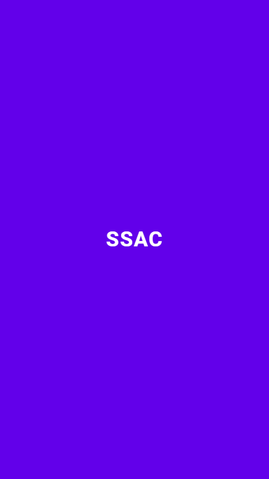


#### 로그인

- e-mail / password 유효성 검사 후, 유효할 경우에만 **LOGIN** 버튼이 활성화됩니다.
- 하단의 **Sign up** 링크 클릭 시, 회원가입 페이지로 routing 됩니다.

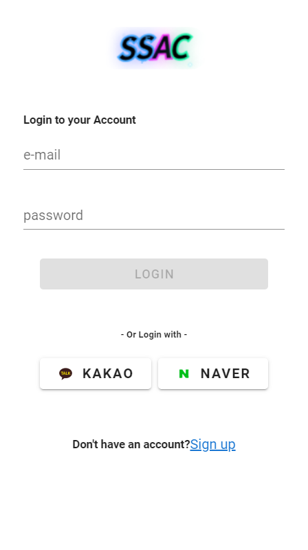


#### 회원가입

- 회원가입 양식 -> MyTeam -> Welcome 총 3 페이지로 구성됩니다.

|                        회원가입 양식                         |                            MyTeam                            |                           Welcome                            |
| :----------------------------------------------------------: | :----------------------------------------------------------: | :----------------------------------------------------------: |
| 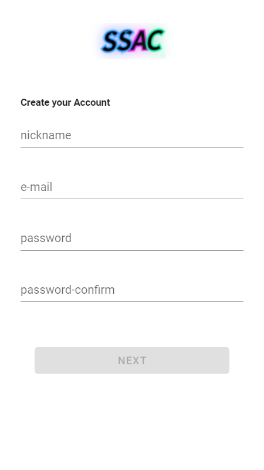 |  | 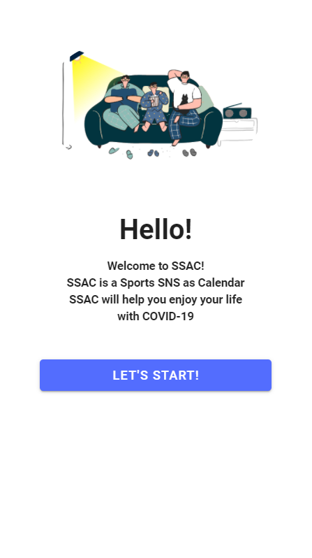 |

- 회원가입 양식 작성
  - 회원가입 양식을 유효하게 작성하였을 경우에만 **NEXT** 버튼이 활성화됩니다.
  - **NEXT** 버튼 클릭 시, MyTeam 페이지로 라우팅됩니다.

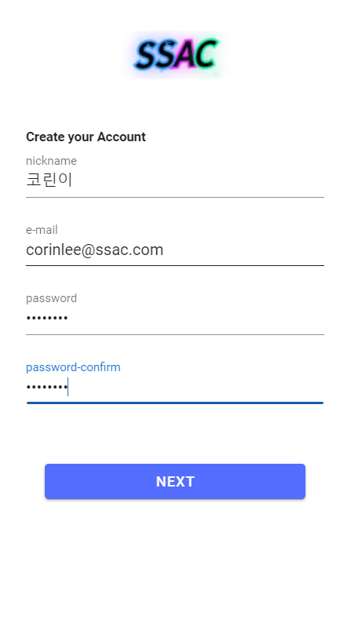

- MyTeam
  - 각 스포츠 팀의 로고, 이름, 팬덤 수, 좋아요 버튼이 있는 카드가 한 줄에 3팀씩 구성되어 출력됩니다.
  - **Total** / **Football** / **Baseball** / **LoL** 버튼을 클릭하면 스포츠 팀들의 종목별로 필터링해 출력됩니다.
  - 검색창에 키워드를 입력하면, 팀 이름에 해당 키워드가 포함된 팀들이 필터링해 출력됩니다. 이 때, 종목별 필터링 버튼과 & 연산으로 둘 다 적용되어 필터링 됩니다.  
  - 각 팀의 카드 하단에 위치한 **하트**모양 버튼을 클릭하면, MyTeams DB에 저장됩니다.
  - 페이지 상단의 **→** 버튼을 클릭하면, Welcome 페이지로 routing 됩니다. 
  - 페이지 상단의 **←** 버튼을 클릭하면, 회원가입 양식 페이지로 routing 됩니다. 

|                            Total                             |                           Football                           |                           Baseball                           |                             LoL                              |                          LoL + 'F'                           |
| :----------------------------------------------------------: | :----------------------------------------------------------: | :----------------------------------------------------------: | :----------------------------------------------------------: | :----------------------------------------------------------: |
| 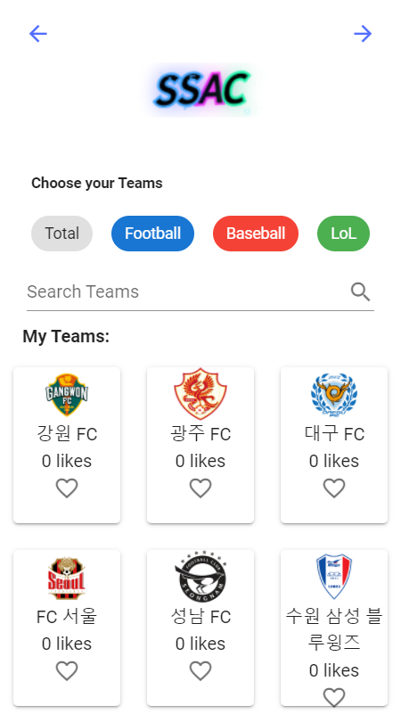 |  | 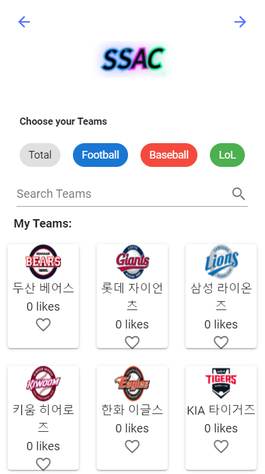 | 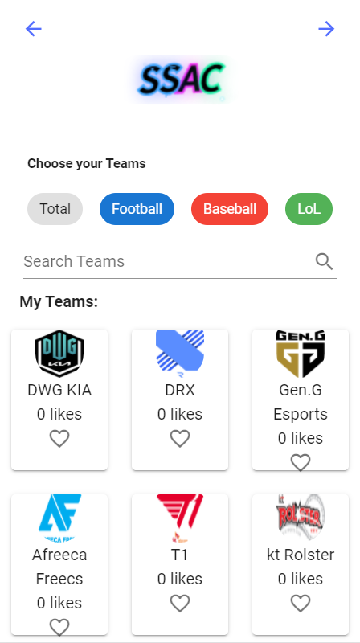 | 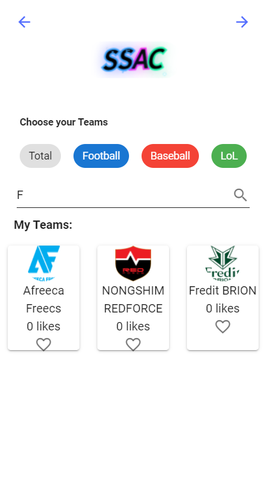 |

- Welcome
  - **LET'S START!** 버튼 클릭시, 통합 스케줄 페이지로 routing 됩니다.

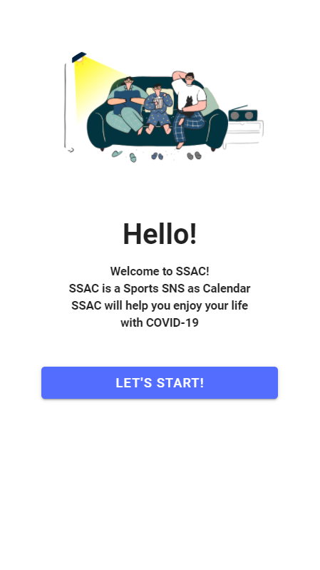

#### 통합 스케줄


* 로그인을 하게 되면 가장 먼저 보이는 메인 페이지
* 당일 경기일정
  * 당일 My Team 설정한 팀 일정을 보여줍니다.
  * 메인 페이지 상단에 보여줍니다.
  * 캐러셀, 카드를 통해서 한눈에 잘 보이도록 구현했습니다. 
* 필터링 스케줄
  * My Team들의 모든 경기일정을 하단부 달력에서 확인할 수 있습니다.
  * 중단에 위치한 팀 로고모양의 필터를 통해 해당팀의 경기일정을 끄고 킬 수 있습니다. 

#### 베팅-1

| 베팅1                                                        | 베팅2                                                        |
| ------------------------------------------------------------ | ------------------------------------------------------------ |
|  | 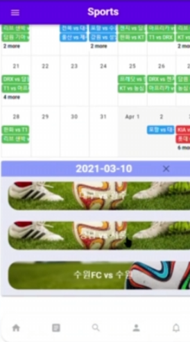 |

* 달력을 누르면 달력 하단부에 해당 일의 경기 정보들을 보여줍니다.
  * 종목에 따라 배경을 바뀌게해 한눈에 보기 쉽도록 했습니다. 


#### 베팅-2

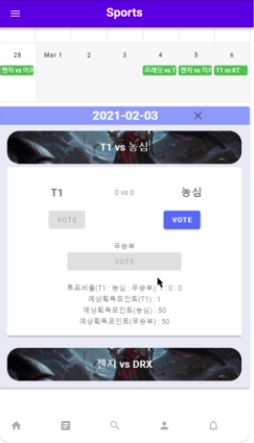

* 해당일의 경기 일정을 클릭하면 베팅창이 열립니다. 
  * 승 무 패 에 베팅을 할 수 있으며 예상획득포인트를 확인할 수 있습니다.


#### 순위 / 기사

| 순위                                                         | 기사                                                         |
| ------------------------------------------------------------ | ------------------------------------------------------------ |
|  |  |

* 순위
  * 실시간 데이터 크롤링 서버를 통해 결과를 반영합니다. 
  * 상단의 버튼을 통해 각 종목별 순위를 확인 할 수 있습니다.
* 기사
  * 실시간 데이터 크롤링 서버를 통해 결과를 반영합니다. 
  * 상단의 버튼을 통해 각 종목별 기사를 확인할 수 있습니다.
  * 기사의 이미지와 헤드라인을 보여줘 대략적인 내용을 사용자에게 알려줍니다.
  * 클릭시 해당 기사페이지로 넘어갑니다.


#### 채팅

>당일의 경기들을 대상으로 채팅을 제공합니다.

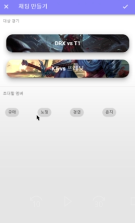

* 채팅 만들기
  * 대상경기는 당일 경기입니다.
  * 초대할 멤버는 사용자가 팔로우하고있는 회원입니다.

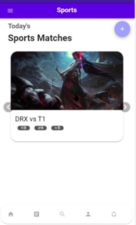

* 채팅 목록

  * 채팅 만들기 창을 통해 만든 채팅목록이 보여집니다. 

  * 이미지를 통해 해당 경기의 종목을 확인할 수 있습니다.

  * 카드안에 경기정보와 채팅방 멤버들의 목록이 담겨있습니다. 

    

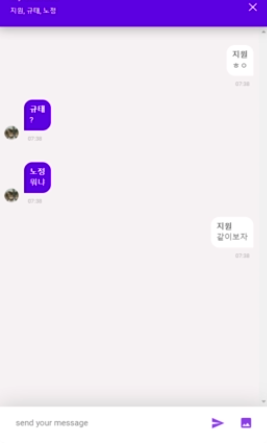

* 채팅방
  * Vue-Quick-Chat Api를 이용했습니다.
  * Web Socket 통신을 이용해 실시간 채팅을 구현했습니다. 


#### 피드

> Following 하는 사용자들과 사용자 본인의 게시글을 작성 / 수정 / 삭제 및 확인할 수 있습니다.


- 게시글 작성
  - 게시글 내용을 작성 후, **SUBMIT** 버튼을 클릭하면 해당 게시글이 DB에 저장되어 보여집니다.  
  - 이미지 업로드 또한 가능합니다.

|                         게시글 작성                          |                        게시글 DB 저장                        |
| :----------------------------------------------------------: | :----------------------------------------------------------: |
| 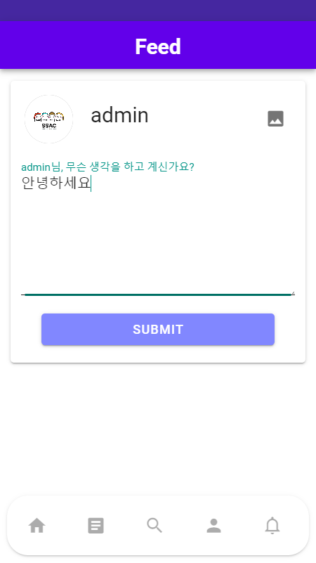 | 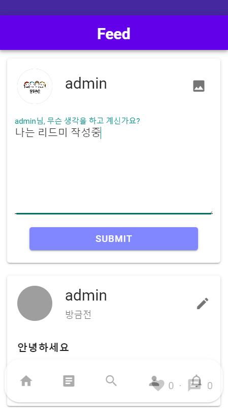 |

- 게시글 수정 및 삭제
  - 게시글을 작성한 사용자가 **연필** 모양 버튼 클릭 시, 게시글 수정 및 삭제 modal 창이 팝업됩니다.
  - 저장된 게시글 내용과 이미지 또한 그대로 저장되어 출력됩니다. 

|                        저장된 게시글                         |                  저장된 게시글 수정 및 삭제                  |
| :----------------------------------------------------------: | :----------------------------------------------------------: |
| 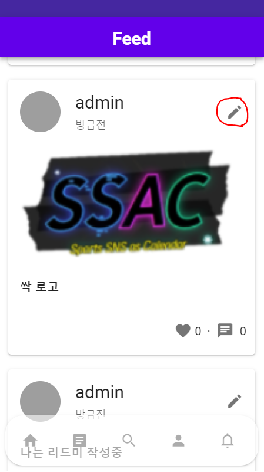 | 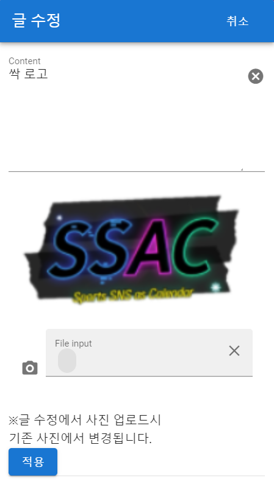 |

- 게시글 좋아요
  - 게시글 Card 하단에 **하트** 모양 버튼 클릭 시, 그 게시글의 like/unlike가 실행됩니다. 

|                             LIKE                             |                            UNLIKE                            |
| :----------------------------------------------------------: | :----------------------------------------------------------: |
| 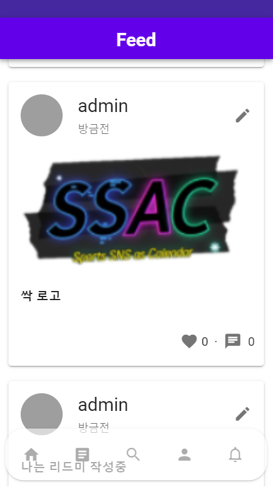 | 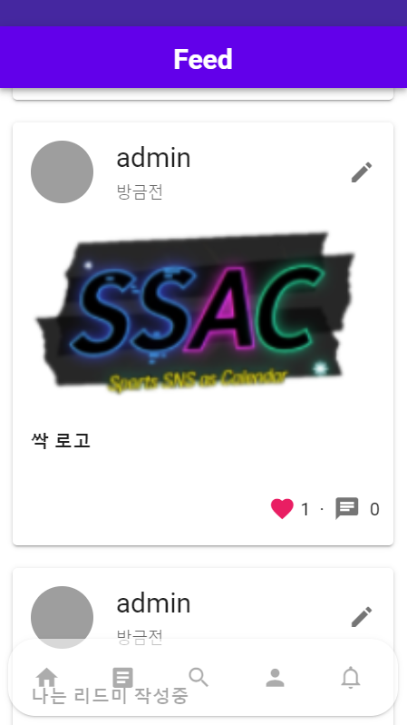 |

- 게시글의 댓글
  - 게시글 Card 하단에 **메시지** 모양 버튼 클릭 시, 그 게시글의 댓글 모달창이 팝업됩니다. 
  - 댓글 내용을 작성 후, **입력** 버튼을 클릭하면 해당 댓글이 DB에 저장되어 보여집니다. 
  - 댓글을 작성한 사용자가 **연필** 모양 버튼 클릭 시, 댓글을 수정할 수 있습니다.
  - 댓글을 작성한 사용자가 **휴지통** 모양 버튼 클릭 시, 댓글을 삭제할 수 있습니다.

|                         댓글 모달 창                         |                      댓글 작성 후, 저장                      |
| :----------------------------------------------------------: | :----------------------------------------------------------: |
| 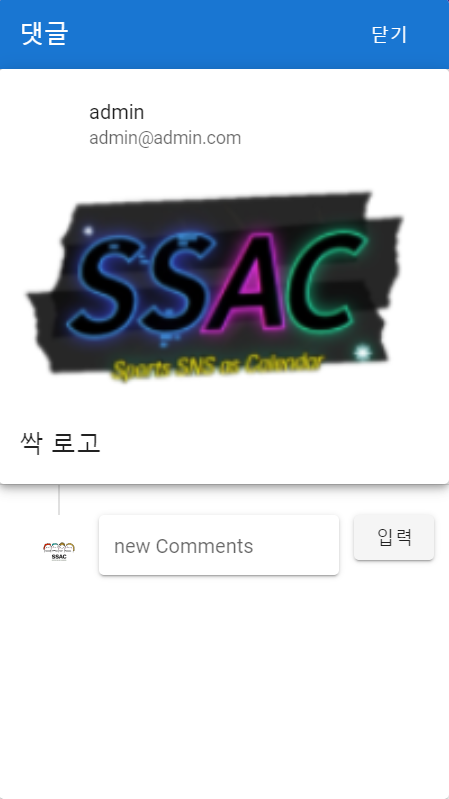 | 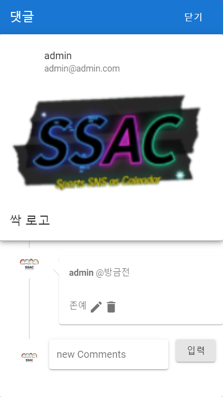 |


#### 검색

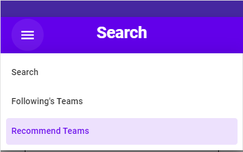

검색은 다음과 같이 3개의 탭으로 구성되어 있습니다.


* 검색창(Search)

  * 검색어 하나로 해당 검색어가 들어간 유저와 팀을 모두 검색해줍니다.

  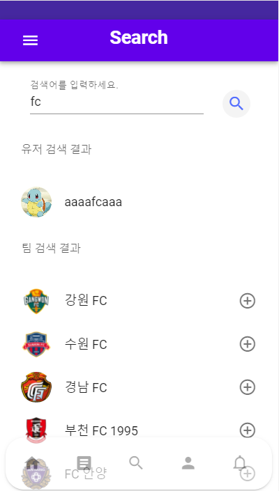

  * 유저 검색

  * 팀 검색

    * 팀 옆에 + 버튼을 누르면 마이팀(내가 관심있는 팀) 목록으로 들어가게됩니다.

    

* 친구의 팀 추천(Following's Teams)

  * 현재 내가 팔로우한 친구들이 마이팀(관심있는 팀)으로 등록해놓은 팀을 보여줍니다.
  * 친구들 중에 팔로우 수가 가장 많은 팀 순으로 상위 5개의 팀을 추천해줍니다.

  

* 새로운 팀 추천(Recommend Teams)

  * 설문지에 따라 설문을 진행하면, 그에 알맞는 팀을 추천해줍니다.

  * 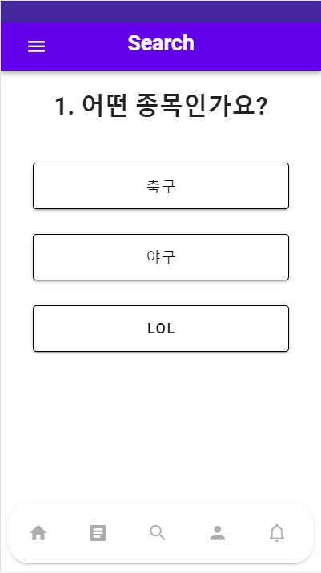

  * ```
    설문지 내용
    1. 어떤 종목인가요?
    축구, 야구, LOL
    
    2. 어떤 경기가 더 좋아요?
    화끈한 경기력이었지만 졌잘싸, 꾸역꾸역이지만 이겼으니 만족!
    
    3. 어떤 팀을 더 선호하나요?
    자주 이기는 상위권팀, 예측할 수 없는 중위권 팀, 반전을 꿈꾸는 하위권 팀
    
    4. 어떤게 더 좋아요?
    한 명의 슈퍼스타가 이끄는 팀, 모두가 헌신하는 팀
    ```


#### 프로필

| 프로필-게시글             | 프로필-내팀               | 프로필-새로운팀                         |
| ------------------------- | ------------------------- | --------------------------------------- |
| 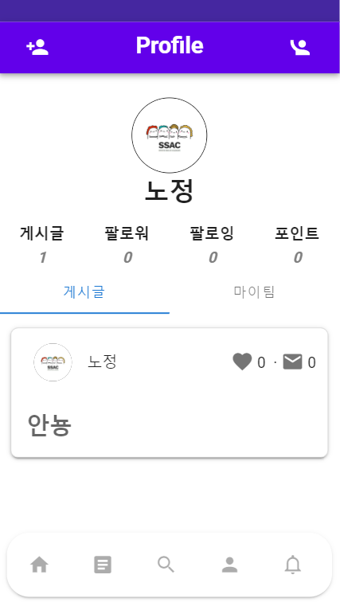 | 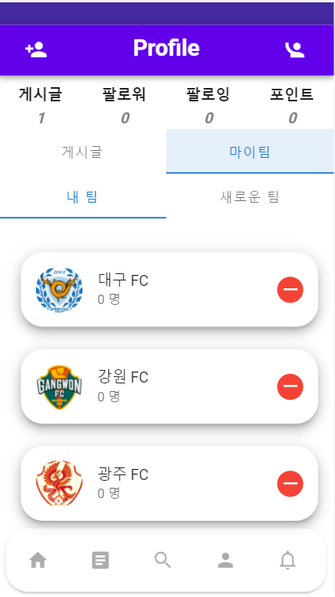 | 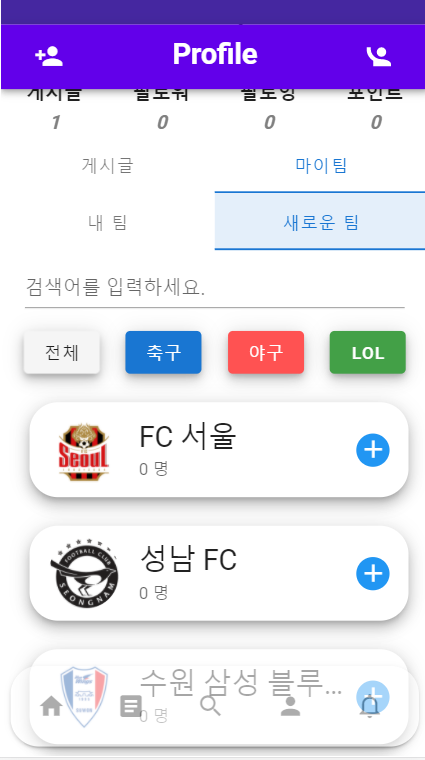 |

* 프로필-게시글
  * 프로필사진, 좋아요수, 댓글수, 글 내용이 나오도록 배치
  * 프로필에서는 개인이 작성한 게시글을 확인가능
* 프로필-내 팀
  * 내 팀으로 추가한 팀의 목록을 보여줍니다.
  * 해당 팀의 팔로워 수를 확인할 수 있습니다.
  * `-`버튼을 통해서 내 팀 목록에서 삭제할 수 있습니다.
* 프로필- 새로운팀
  * 종목별 내 팀 목록에 없는 팀들을 보여줍니다.
  * `+`버튼을 통해서 내 팀 목록에 추가할 수 있습니다.


## ERD


## JIRA

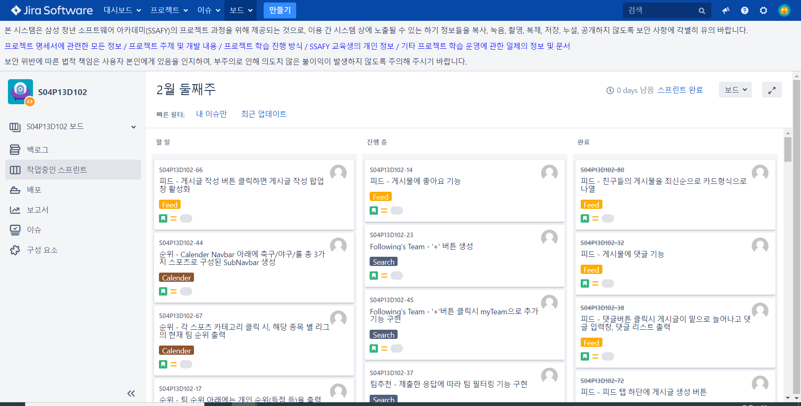


* 전체 할일
  * 백로그 창에서 각 파트별 개발업무를 이슈에 추가했습니다.
  * 공통 이슈의 경우 팀원에게 보고 후 추가했습니다.
* 스프린트 
  * 매 주 백로그의 이슈들 중 개발 대상들을 스프린트에 담았습니다.
  * 이를 통해 매 주 개발해야할 기능들을 쉽게 알 수 있었고 집중할 수 있었습니다.
  
    


## 프로젝트 소감

#### 팀장 : 이지원

* 백엔드는 프론트엔드의 진행상황을 다 파악하고 있어야한다는 것을 알게 되었습니다.
  * 단순히 프론트엔드에서 요청하면 원하는 데이터를 보내주는 API를 작성하는것이라 생각했습니다. 하지만 백엔드에서 먼저 진행상황을 파악해서 더미데이터를 보내주는 fake API를 만들어 프론트가 수월하게 작업할 수 있게 해주는 것이 중요하다는 것을 알게 되었습니다. 
* 백엔드도 프론트 개발스택에 대한 이해도가 필요하다는 것을 느꼈습니다.
  * API의 기능에 맞게 타입을 정하고 API를 작성한 뒤 스웨거를 사용해서 설명을 달면 끝이라 생각했는데 프론트엔드에서 데이터를 어떻게 받아서 어떤식으로 사용할 수 있는지에 대해서 몰랐기 때문에 통신에 어려움이 있었습니다.
* 프론트엔드와 백엔드의 소통이 가장 중요하다는 것을 알게 되었습니다.
  * 이번 프로젝트를 통해 팀원들과의 소통이 중요하다는 것을 깨닫게 되었고 좀 더 효율적으로 프로젝트를 진행할 수 있게 된 것 같습니다.


#### 팀원 : 박노정

* 서로에 대한 관심이 프로젝트를 완성하는데 가장 결정적인 요소인것을 느꼈습니다.
  * 이전까지는 역할분담을 잘해서 서로의 할일을 끝내면 퍼즐맞추듯 하나의 프로젝트가 완성되는 것이라 생각했습니다. 하지만 이번 프로젝트를 하면서, 맡은 일을 잘하는 것은 기본이고 내 팀원이 어느정도로 했는지, 어려움은 없는지 잘 체크하면서 팀의 전체적인 속도를 맞추는 것이 프로젝트를 성공적으로 마칠 수 있는 방법이라는 것을 꺠달았습니다.
* 주석의 중요성을 느꼈습니다.
  * 여태 많은 사람과 협업한 경험이 없고 혼자 혹은 둘이서 프로젝트를 진행했기때문에 주석을 거의 달지 않았습니다. 혼자 그 코드를 볼때는 문제가 없었지만 이번 프로젝트에서는 팀원을 코드를 볼때면 이해하는데 상당히 오랜시간이 걸렸습니다. 디버깅 또한 마찬가지였습니다. 반대로 팀원들 역시 제 코드를 볼때 같은 느낌을 받았을 것입니다. 코드에 주석을 달아놓았다면 이러한 불편함이 상당히 줄어들었을 것이라고 생각합니다. 
* 여러 어려움에도 불구하고 좋았던점.
  * 이번 프로젝트에서는 채팅기능을 처음 개발해봤기때문에 꽤 오랜시간 고생했습니다. 또 더해서 팀원간 소통이 불완전했었기때문에 힘들었습니다. 그래도 이번 프로젝트를 거치면서 저는 좀 더 좋은 코드를 짜기위해 공식문서, 구글링, 오픈소스를 뒤져가며 만들었고 그 과정에서 기술적인 면도 많이 늘었지만 인내심을 많이 기를 수 있었습니다. 결국 프로젝트는 얼마나 견디며 좋은 결과물을 만들어내는지 싸움이기에 좋은 방면으로 성장했다고 생각합니다. 소통 또한 '얼만큼 했겠지?' 가 아니라 "얼마나 했어요?"라고 물어보는게 더 중요하다는 것을 깨달았습니다. 앞으로의 프로젝트에서 소통에서의 시행착오를 미리 겪었다고 느끼며 프로젝트 소통의 팁(?)을 얻은것같아 좋습니다.


#### 팀원 : 이경연

- 저는 무엇보다도 `소통의 중요성`을 많이 느꼈습니다. 
  - `팀은 개인이 잘한다고 해서 유지되는 것이 아니다.`라는 것을 배웠습니다. 코로나 때문에 소통에 어느정도 지장이 있을 수 밖에 없지만, 프로젝트 초기에는 기본적인 소통조차 제대로 이루어지지 않았기에 계획대로 잘 진행되지 않았습니다. 그래서 소통의 문제를 해결해보고자, 교수님께 면담을 신청하였습니다. 교수님과의 면담을 통해 부드럽게 개선 방법을 찾을 수 있었습니다. 
  - `서로가 더 잘 할 수 있는 부분 / 조금 부족한 부분에 대해서 충분히 얘기를 나누고 나서 업무 분담을 했었더라면, 조금 더 진행이 원활하지 않았을까 ?` 라는 생각을 많이 하였습니다.  이전에는 Back-end와 Front-end를 그냥 팀 전체 인원 수의 대략 1/2 씩 배분하면 된다고만 안일하게 생각하였습니다. 물론 저희 팀 특성상 유일한 전공자 1명만 Back-end를 담당하게 되었지만, 이번 프로젝트를 진행하면서 Back-end는 프로젝트를 가장 잘 이해하고 있는 사람이 담당하여야 한다고 생각하게 되었습니다. 왜냐하면, 프로젝트를 가장 잘 이해하는 사람이 DB 설계부터 제대로 해놔야 Front-end를 담당한 사람들 또한 설계된 DB를 토대로 데이터 필드를 설정할 수 있기 때문입니다.
  - 소통의 부재로 이러한 문제점들을 겪었지만, 잘 극복하고 프로젝트를 마무리지을 수 있어서 여러모로 기억에 많이 남을 것 같습니다. 


#### 팀원 : 백규태

*  이번 프로젝트를 하면서 소통이 매우 중요하다는 것을 알았습니다. 기본적으로 백-프론트간 소통이 잘 안되어 간단한 기능구현에도 오랜 시간이 걸렸고 프론트끼리의 소통도 부족하여 같이 공유하는 변수 명을 다르게 설정하는 등 여러 문제가 있었습니다. 소통문제는 프로젝트 중간에 팀원들이 뼈저리게 느껴 카톡이나 MM, 아침미팅에서 오늘의 할 일이나 이슈등을 서로 공유하며 해결했습니다.
   또 하나는 프로젝트 기술관리자의 부재가 있었습니다. 전체를 보는 사람이 없고 각자 자신의 역할에 치중하다보니 서로 불필요한 작업을 하거나 연동이 안되는 경우도 있었습니다. 예를들면 똑같은 API를 두 개 만들거나 피드에서 바로 다른 사람의 프로필로 넘어가는 부분 등 구현하기 간단한 몇몇 기능들을 빼놓은 점이 있습니다. 
   이번 경험을 통해 프로젝트를 좀 더 효율적으로 진행하는 방법을 조금이나마 깨달은 것 같습니다.


#### 팀원 : 이은지

* Code convention 의 중요성을 느꼈습니다. 컨벤션을 통한 코드의 일관성을 유지하는 것이, 향후 코드 관리 및 유지보수에 용이하다는 것을 배웠습니다.
* 능력있는 팀원의 든든함을 느꼈습니다. 여러 시행착오와 고생이 있음에도, '과연 할 수 있을까' 싶었던 기능을 결국 해내는 팀원의 존재가 든든했습니다.
* 코드리뷰의 필요성을 많이 느꼈습니다. 각자 작업하고 하나로 합치는 과정에서 서로의 코드를 이해하기 위해 코드리뷰의 필요성을 느꼈고, 주석을 달아서 이해를 도왔습니다.

