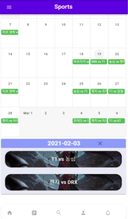
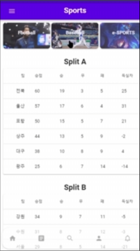

> 배포서버 : 
> (Galaxy S5에 최적화) 
> 2021.02.26 배포서버 종료 


## SSAC (SSAFY Sports as Clalender)

> 캘린더에 관람하고자 하는 모든 종목의 스포츠 경기를 ‘큐레이팅’ 하고, 그 일정을 팔로워들과 공유하는 SNS


## 프로젝트 기획배경

1. 스포츠 경기를 관람할 때 마다 함께 관람할 사람을 찾는 것이 번거로워서, 
   내가 보고자 하는 경기와 친구가 보고자 하는 경기를 공유함으로써 편하게 관람 
   메이트를 찾기 위해서
2. 원래는 종목 별로 경기 일정을 따로 확인해야 하는데, 종목 상관없이 내가 
   관심있는 팀의 일정을 한꺼번에 확인하기 위해서


## 프로젝트 상세 소개

인증이 된 사용자는 캘린더에 사용자가 관심 등록해 놓은 스포츠 팀들의 경기 일정을 종목(축구, 야구, 롤챔스) 상관없이 한꺼번에 확인할 수 있으며, 카테고리 별로도 확인할 수 있습니다.

 팔로우한 사용자들과 함께 서로의 경기 관람 스케줄을 공유하며, 실시간으로 채팅을 하며 의견을 공유할 수 있습니다. 

그리고 관심 등록한 팀 외에 다른 팀들을 추천 받을 수 있습니다. 순위 탭을 누르면 팀 순위나 개인 순위를 확인할 수 있습니다. 승부 예측하여 승부 결과를 맞힌 경우, 포인트를 획득하게 됩니다. 


## 팀원 정보 및 업무 분담 내역

#### 팀장 : 이지원

* Back-end
  * DB
    * MySQL을 이용해 DB를 설계하고 Mybatis를 사용해 백엔드서버와 연동
  * 백엔드서버
    * Spring Boot를 이용해 RESTful하게 데이터를 주고 받을 수 있는 서버 구축
    * Swagger를 사용해 프론트엔드에서 쉽게 데이터 통신 결과를 확인할 수 있게 설정
  * 채팅서버
    * Spring Boot와 WebSocket, Stomp를 이용해 실시간 채팅이 가능한 서버 구축
  * 배포
    * AWS EC2 서버에서 Nginx를 이용해서 프론트엔드와 백엔드 배포


#### 팀원 : 박노정

* Front-end
  * 채팅
    * Vuetify를 이용해서 채팅방생성 모달, 채팅방 목록 페이지 구현
    * 채팅방 생성창에서 선택된 경기정보, 채팅멤버들의 정보를 채팅방으로 전달하는 기능 구현
    * 각 채팅방이 고유의 방을 가지도록 구현
    * `vue-quick-chat` API를 통해 실시간 채팅방 구현
  * 프로필
    * 전체적인 UI 구성
  * 프로필 편집
    * 프로필 수정을 위한 페이지를 구성


#### 팀원 : 이경연

* Front-end
  * 전반적인 UI 및 로고 디자인
    * SSAC 컨셉에 맞는 UI 디자인 예시들을 정리하여 팀원들에게 공유
    * 메인 컬러 지정
    * 로고 디자인
  * 시작 화면
    * SSAC 버튼 클릭 시, 로그인 화면으로 routing
  * 로그인
  * 회원가입
  * 피드
    * 본인이 Following한 사용자들과 본인의 게시글 CRUD
    * 각 게시글마다 1:N 관계로 `댓글` CRUD
    * 각 게시글마다 1:N관계도 `좋아요` CD


#### 팀원 : 백규태

* 프론트엔드
  * 기본적인 화면 구성
    * 다른 프론트엔드 팀원들이 보기쉽게 Vue 프로젝트 틀 잡기
  * 스케쥴
    * vuetify의 캘린더 기능을 활용하여 경기들을 월별로 보기 쉽게 정리
    * 간단한 식을 이용하여 베팅 시스템 구축
  * 뉴스
    * 크롤링한 정보를 종목별로 리스트로 나타내어 뉴스의 원본 링크에 연결
  * 랭킹
    * 크롤링한 정보를 종목별로 나타내어 화면에 나타냄


#### 팀원 : 이은지

* Front-end
  * "사용자 프로필" 데이터 파싱
    * 사용자의 프로필에 접근했을 때의 기본적인 정보를 파싱
    * 특정 사용자의 게시글 수, 팔로잉/팔로워 수, 보유 포인트 등 개별 정보를 파싱
    * Axios 통신을 통한 DB 연동 구현
  * "Search 바" 기능 구현
    * 검색창 하나로, 해당 검색어가 포함된 사용자와 팀(축구, 야구, 롤 팀)을 한 눈에 보여주는 기능 구현
  * ''친구의 팀'' 기능 구현
    * 내가 Follow한 친구가 관심있어하는 팀을 나에게 추천해주는 기능 구현
  * "팀 추천" 기능 구현
    * 주어진 설문지를 본인의 취향에 맞게 선택하면, 그와 유사한 팀을 추천해주는 기능 구현
    * 사용자 별로 특화된 팀 추천이 가능하도록 구현


## 목표 서비스 구현 및 실제 구현 정보

> 개발 도구 : Java, Spring Boot, MySQL,Web Socket, Vue, Vuetify, css, html


#### 시작화면

- 중간의 **SSAC** 버튼 클릭 시, 로그인 페이지로 routing 됩니다.


#### 로그인

- e-mail / password 유효성 검사 후, 유효할 경우에만 **LOGIN** 버튼이 활성화됩니다.
- 하단의 **Sign up** 링크 클릭 시, 회원가입 페이지로 routing 됩니다.


#### 회원가입

- 회원가입 양식 -> MyTeam -> Welcome 총 3 페이지로 구성됩니다.

|                        회원가입 양식                         |                            MyTeam                            |                           Welcome                            |
| :----------------------------------------------------------: | :----------------------------------------------------------: | :----------------------------------------------------------: |
|  |  |  |

- 회원가입 양식 작성
  - 회원가입 양식을 유효하게 작성하였을 경우에만 **NEXT** 버튼이 활성화됩니다.
  - **NEXT** 버튼 클릭 시, MyTeam 페이지로 라우팅됩니다.


- MyTeam
  - 각 스포츠 팀의 로고, 이름, 팬덤 수, 좋아요 버튼이 있는 카드가 한 줄에 3팀씩 구성되어 출력됩니다.
  - **Total** / **Football** / **Baseball** / **LoL** 버튼을 클릭하면 스포츠 팀들의 종목별로 필터링해 출력됩니다.
  - 검색창에 키워드를 입력하면, 팀 이름에 해당 키워드가 포함된 팀들이 필터링해 출력됩니다. 이 때, 종목별 필터링 버튼과 & 연산으로 둘 다 적용되어 필터링 됩니다.  
  - 각 팀의 카드 하단에 위치한 **하트**모양 버튼을 클릭하면, MyTeams DB에 저장됩니다.
  - 페이지 상단의 **→** 버튼을 클릭하면, Welcome 페이지로 routing 됩니다. 
  - 페이지 상단의 **←** 버튼을 클릭하면, 회원가입 양식 페이지로 routing 됩니다. 

|                            Total                             |                           Football                           |                           Baseball                           |                             LoL                              |                          LoL + 'F'                           |
| :----------------------------------------------------------: | :----------------------------------------------------------: | :----------------------------------------------------------: | :----------------------------------------------------------: | :----------------------------------------------------------: |
|  |  |  |  |  |

- Welcome
  - **LET'S START!** 버튼 클릭시, 통합 스케줄 페이지로 routing 됩니다.


#### 통합 스케줄


* 로그인을 하게 되면 가장 먼저 보이는 메인 페이지
* 당일 경기일정
  * 당일 My Team 설정한 팀 일정을 보여줍니다.
  * 메인 페이지 상단에 보여줍니다.
  * 캐러셀, 카드를 통해서 한눈에 잘 보이도록 구현했습니다. 
* 필터링 스케줄
  * My Team들의 모든 경기일정을 하단부 달력에서 확인할 수 있습니다.
  * 중단에 위치한 팀 로고모양의 필터를 통해 해당팀의 경기일정을 끄고 킬 수 있습니다. 

#### 베팅-1

| 베팅1                                                        | 베팅2                                                        |
| ------------------------------------------------------------ | ------------------------------------------------------------ |
|  |  |

* 달력을 누르면 달력 하단부에 해당 일의 경기 정보들을 보여줍니다.
  * 종목에 따라 배경을 바뀌게해 한눈에 보기 쉽도록 했습니다. 


#### 베팅-2


* 해당일의 경기 일정을 클릭하면 베팅창이 열립니다. 
  * 승 무 패 에 베팅을 할 수 있으며 예상획득포인트를 확인할 수 있습니다.


#### 순위 / 기사

| 순위                                                         | 기사                                                         |
| ------------------------------------------------------------ | ------------------------------------------------------------ |
|  |  |

* 순위
  * 실시간 데이터 크롤링 서버를 통해 결과를 반영합니다. 
  * 상단의 버튼을 통해 각 종목별 순위를 확인 할 수 있습니다.
* 기사
  * 실시간 데이터 크롤링 서버를 통해 결과를 반영합니다. 
  * 상단의 버튼을 통해 각 종목별 기사를 확인할 수 있습니다.
  * 기사의 이미지와 헤드라인을 보여줘 대략적인 내용을 사용자에게 알려줍니다.
  * 클릭시 해당 기사페이지로 넘어갑니다.


#### 채팅

>당일의 경기들을 대상으로 채팅을 제공합니다.


* 채팅 만들기
  * 대상경기는 당일 경기입니다.
  * 초대할 멤버는 사용자가 팔로우하고있는 회원입니다.


* 채팅 목록

  * 채팅 만들기 창을 통해 만든 채팅목록이 보여집니다. 

  * 이미지를 통해 해당 경기의 종목을 확인할 수 있습니다.

  * 카드안에 경기정보와 채팅방 멤버들의 목록이 담겨있습니다. 

    


* 채팅방
  * Vue-Quick-Chat Api를 이용했습니다.
  * Web Socket 통신을 이용해 실시간 채팅을 구현했습니다. 


#### 피드

> Following 하는 사용자들과 사용자 본인의 게시글을 작성 / 수정 / 삭제 및 확인할 수 있습니다.


- 게시글 작성
  - 게시글 내용을 작성 후, **SUBMIT** 버튼을 클릭하면 해당 게시글이 DB에 저장되어 보여집니다.  
  - 이미지 업로드 또한 가능합니다.

|                         게시글 작성                          |                        게시글 DB 저장                        |
| :----------------------------------------------------------: | :----------------------------------------------------------: |
|  |  |

- 게시글 수정 및 삭제
  - 게시글을 작성한 사용자가 **연필** 모양 버튼 클릭 시, 게시글 수정 및 삭제 modal 창이 팝업됩니다.
  - 저장된 게시글 내용과 이미지 또한 그대로 저장되어 출력됩니다. 

|                        저장된 게시글                         |                  저장된 게시글 수정 및 삭제                  |
| :----------------------------------------------------------: | :----------------------------------------------------------: |
|  |  |

- 게시글 좋아요
  - 게시글 Card 하단에 **하트** 모양 버튼 클릭 시, 그 게시글의 like/unlike가 실행됩니다. 

|                             LIKE                             |                            UNLIKE                            |
| :----------------------------------------------------------: | :----------------------------------------------------------: |
|  |  |

- 게시글의 댓글
  - 게시글 Card 하단에 **메시지** 모양 버튼 클릭 시, 그 게시글의 댓글 모달창이 팝업됩니다. 
  - 댓글 내용을 작성 후, **입력** 버튼을 클릭하면 해당 댓글이 DB에 저장되어 보여집니다. 
  - 댓글을 작성한 사용자가 **연필** 모양 버튼 클릭 시, 댓글을 수정할 수 있습니다.
  - 댓글을 작성한 사용자가 **휴지통** 모양 버튼 클릭 시, 댓글을 삭제할 수 있습니다.

|                         댓글 모달 창                         |                      댓글 작성 후, 저장                      |
| :----------------------------------------------------------: | :----------------------------------------------------------: |
|  |  |


#### 검색


검색은 다음과 같이 3개의 탭으로 구성되어 있습니다.


* 검색창(Search)

  * 검색어 하나로 해당 검색어가 들어간 유저와 팀을 모두 검색해줍니다.

  

  * 유저 검색

  * 팀 검색

    * 팀 옆에 + 버튼을 누르면 마이팀(내가 관심있는 팀) 목록으로 들어가게됩니다.

    

* 친구의 팀 추천(Following's Teams)

  * 현재 내가 팔로우한 친구들이 마이팀(관심있는 팀)으로 등록해놓은 팀을 보여줍니다.
  * 친구들 중에 팔로우 수가 가장 많은 팀 순으로 상위 5개의 팀을 추천해줍니다.

  

* 새로운 팀 추천(Recommend Teams)

  * 설문지에 따라 설문을 진행하면, 그에 알맞는 팀을 추천해줍니다.

  * 

  * ```
    설문지 내용
    1. 어떤 종목인가요?
    축구, 야구, LOL
    
    2. 어떤 경기가 더 좋아요?
    화끈한 경기력이었지만 졌잘싸, 꾸역꾸역이지만 이겼으니 만족!
    
    3. 어떤 팀을 더 선호하나요?
    자주 이기는 상위권팀, 예측할 수 없는 중위권 팀, 반전을 꿈꾸는 하위권 팀
    
    4. 어떤게 더 좋아요?
    한 명의 슈퍼스타가 이끄는 팀, 모두가 헌신하는 팀
    ```


#### 프로필

| 프로필-게시글             | 프로필-내팀               | 프로필-새로운팀                         |
| ------------------------- | ------------------------- | --------------------------------------- |
|  |  |  |

* 프로필-게시글
  * 프로필사진, 좋아요수, 댓글수, 글 내용이 나오도록 배치
  * 프로필에서는 개인이 작성한 게시글을 확인가능
* 프로필-내 팀
  * 내 팀으로 추가한 팀의 목록을 보여줍니다.
  * 해당 팀의 팔로워 수를 확인할 수 있습니다.
  * `-`버튼을 통해서 내 팀 목록에서 삭제할 수 있습니다.
* 프로필- 새로운팀
  * 종목별 내 팀 목록에 없는 팀들을 보여줍니다.
  * `+`버튼을 통해서 내 팀 목록에 추가할 수 있습니다.


## ERD


## JIRA


* 전체 할일
  * 백로그 창에서 각 파트별 개발업무를 이슈에 추가했습니다.
  * 공통 이슈의 경우 팀원에게 보고 후 추가했습니다.
* 스프린트 
  * 매 주 백로그의 이슈들 중 개발 대상들을 스프린트에 담았습니다.
  * 이를 통해 매 주 개발해야할 기능들을 쉽게 알 수 있었고 집중할 수 있었습니다.
  

